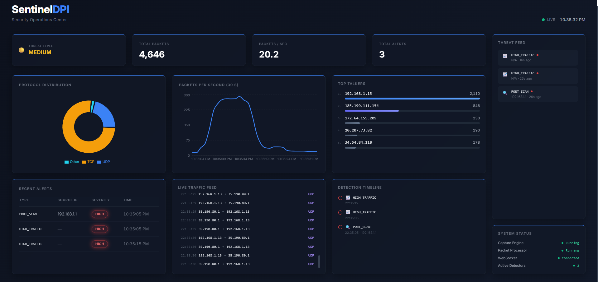

# SentinelDPI

A **real-time Deep Packet Inspection (DPI) and network monitoring system** with a **Security Operations Center (SOC) style dashboard** built using **Python, FastAPI, React, and Docker**.

SentinelDPI captures live network packets, processes them through a detection pipeline, and streams telemetry to a real-time dashboard for security monitoring and threat visibility.

---

## 🚀 Features

* 📡 **Live Packet Capture** using Scapy
* 📊 **Real-Time SOC Dashboard**
* ⚡ **WebSocket Telemetry Streaming**
* 🛡 **Detection Plugins Architecture**
* 📈 **Traffic Analytics**
* 🚨 **Alert Management System**
* 🧠 **Threat Level Monitoring**
* 🐳 **Docker Deployment Support**

---

## 🖥 Dashboard

The SentinelDPI dashboard provides real-time network visibility similar to a Security Operations Center (SOC).

**Dashboard Widgets**

* Threat Level Indicator
* Total Packets
* Packets per Second
* Protocol Distribution
* Top Talkers (Most Active IPs)
* Live Traffic Feed
* Detection Timeline
* Alerts Table
* System Status Monitor

Example Dashboard View:



---

## 🏗 System Architecture

SentinelDPI uses a modular packet processing pipeline:

```
CaptureEngine
     ↓
PacketQueue
     ↓
PacketProcessor
     ↓
PacketParser
     ↓
MetricsService
     ↓
DetectionManager
     ↓
AlertManager
     ↓
FastAPI + WebSocket
     ↓
React SOC Dashboard
```

### Component Overview

| Component            | Description                                        |
| -------------------- | -------------------------------------------------- |
| **CaptureEngine**    | Captures live network packets using Scapy          |
| **PacketQueue**      | Thread-safe queue between capture and processing   |
| **PacketProcessor**  | Processes packets and extracts structured features |
| **PacketParser**     | Converts packets into normalized data              |
| **MetricsService**   | Tracks traffic metrics and statistics              |
| **DetectionManager** | Runs detection plugins                             |
| **AlertManager**     | Handles alert creation, deduplication, and history |
| **FastAPI API**      | Exposes REST and WebSocket endpoints               |
| **React Dashboard**  | Displays real-time telemetry                       |

---

## 🧠 Detection Capabilities

Current detection plugins include:

### Port Scan Detector

Detects suspicious port scanning activity from source IPs.

### High Traffic Detector

Detects abnormal traffic spikes based on packet rate thresholds.

The plugin-based architecture allows new detectors to be added easily.

---

## 📡 Real-Time Telemetry

Telemetry is streamed to the dashboard via WebSocket every second.

Example payload:

```json
{
  "metrics": {...},
  "top_talkers": [...],
  "traffic_feed": [...],
  "threat_level": "MEDIUM",
  "system_status": {...},
  "alert_activity": [...],
  "alerts": [...]
}
```

---

## 🛠 Tech Stack

### Backend

* Python
* FastAPI
* Scapy
* Threading

### Frontend

* React
* TypeScript
* Tailwind CSS
* Chart.js

### Deployment

* Docker
* Docker Compose
* Nginx

---

## ⚙ Installation (Local Development)

### 1. Clone the repository

```
git clone https://github.com/parth-shinge/SentinelDPI.git
cd SentinelDPI
```

---

### 2. Setup Backend

Create a virtual environment:

```
python -m venv venv
```

Activate it:

Windows

```
venv\Scripts\activate
```

Install dependencies:

```
pip install -r requirements.txt
```

Run the backend:

```
python -m sentinel_dpi.main
```

---

### 3. Setup Frontend

Navigate to the frontend folder:

```
cd dashboard
```

Install dependencies:

```
npm install
```

Run the dashboard:

```
npm run dev
```

---

## 🐳 Running with Docker

To run the full stack using Docker:

```
docker-compose up --build
```

Then open the dashboard:

```
http://localhost:3000
```

---

## 🌐 Network Interface Configuration

SentinelDPI captures packets from a specified network interface.

In `settings.py`:

```python
# Network interface used for packet capture.
# Example values: "Wi-Fi", "Ethernet", or a raw Npcap device like r"\Device\NPF_{GUID}"

interface: str | None = "Wi-Fi"
```

If packet capture does not work, update this value to match your system's active network adapter.

---

## 🧪 Tests

Run backend tests:

```
pytest tests/
```

---

## 📂 Project Structure

```
sentinel_dpi/
│
├── api/
├── core/
├── detection/
├── dpi/
├── services/
│
frontend/
│
docker/
tests/
```

---

## 📈 Future Improvements

Potential future enhancements include:

* GeoIP attacker visualization
* Machine learning anomaly detection
* Historical traffic analytics
* Persistent alert storage
* Multi-node monitoring

---

## 📜 License

This project is intended for **educational and portfolio purposes**.

---

## 👨‍💻 Author

**Parth Shinge**

Computer Science & Engineering Student

GitHub:
https://github.com/parth-shinge
